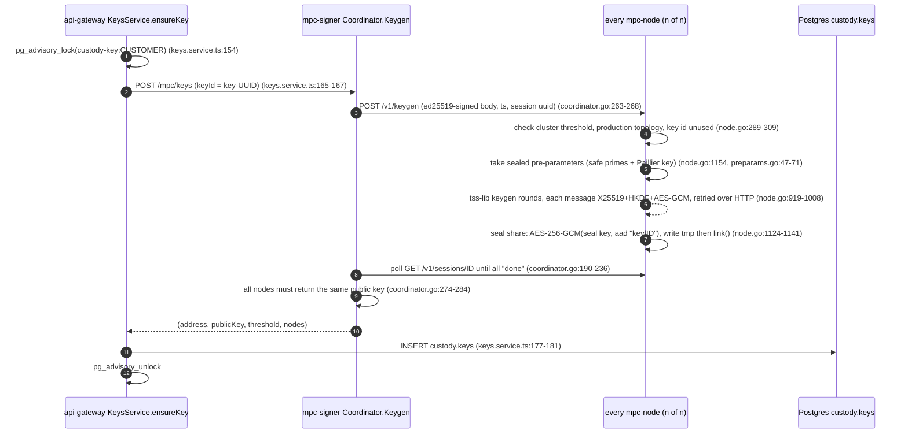
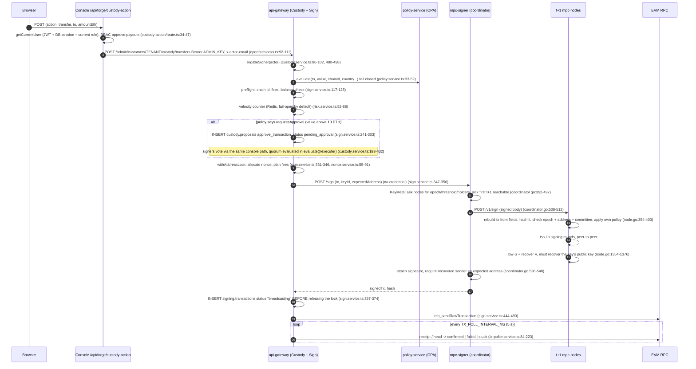
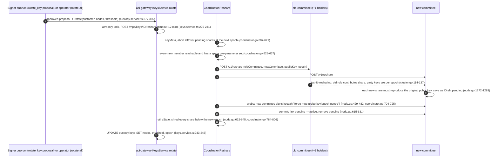
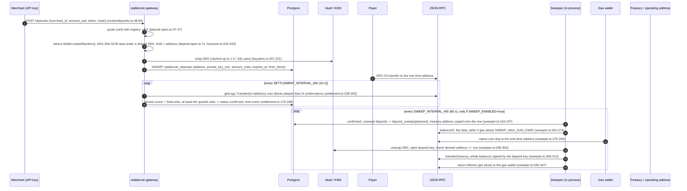
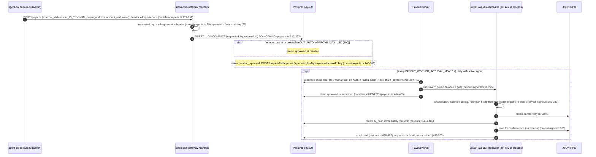
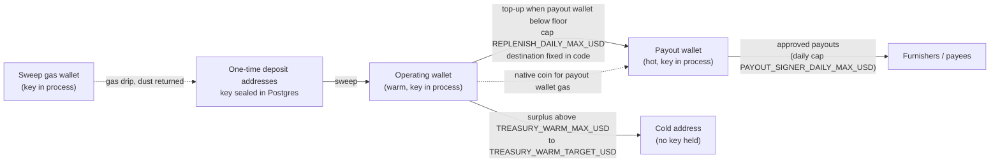

# 01 - System overview

Evidence base: commit `da11f54` (branch `claude/forgepay-platform-design-gEkgE`). Every `path:line` below refers to that
commit. See [README.md](README.md) for the path abbreviations (`MPC`, `OFB`, `CON`, `SGW`, `BUR`).

## 1. What is in scope, in one page

FORGE holds and moves value in **two separate custody models**. A reviewer should treat them as different systems with
different trust assumptions; nothing in the code reviewed links them (a search of `SGW/src` for the MPC signer URL or
cluster files found nothing).

| | Threshold custody (component A + B) | Hot-key stablecoin rails (component C + D) |
|---|---|---|
| Purpose | Per-workspace ETH-style transfers from a threshold-ECDSA key; governed by a signer quorum in the console | Accept stablecoin payments on one-time addresses, sweep them, pay furnishers, keep a payout float |
| Key material | Shares of a secp256k1 key on separate `mpc-node` processes; no process holds the whole key | Whole private keys in the gateway process: one per deposit address (envelope-encrypted in Postgres), plus the payout key, the sweep gas key and the treasury operating key (env var or mounted file) |
| Authorisation | Console RBAC, quorum proposals/votes, policy service, per-node policy | Static API keys (admin / per-merchant), approval threshold on payouts, in-process caps |
| Code | `MPC/**` (Go), `OFB/{custody,sign,blockchain,auth}/**` (NestJS), `CON/app/api/**`, `CON/lib/*` | `SGW/src/**` (Fastify), `BUR/src/{billing,furnisher-payouts,auth}.ts` + asset routes in `BUR/src/index.ts` |

Outside this package: the Mode 2 on-chain contracts (`forgepay/on-chain/`, see README section 6) need their own
smart-contract audit.

## 2. Component map

```mermaid
flowchart LR
  subgraph Internet
    U[Console user<br/>browser]
    M[Merchant / agent<br/>API key holder]
    P[Payer<br/>on-chain sender]
  end

  subgraph Console["Console (CON, Next.js)"]
    C1["app/api/** routes<br/>JWT cookie session"]
  end

  subgraph OFBsvc["openfireblocks"]
    GW[api-gateway<br/>OFB, NestJS]
    PS[policy-service<br/>OPA, Go]
    SIG[mpc-signer<br/>coordinator, Go<br/>MPC main.go]
    N1[mpc-node 1]
    N2[mpc-node 2]
    N3[mpc-node 3]
  end

  subgraph STB["Stablecoin rails"]
    SGWs[stablecoin-gateway<br/>SGW, Fastify]
    BUR[agent-credit-bureau<br/>BUR, Fastify]
  end

  DB1[(Postgres<br/>customers, custody.*,<br/>signing.*, audit.*)]
  DB2[(Postgres<br/>users, sessions,<br/>invitations, audit_log)]
  DB3[(Postgres<br/>stablecoin_deposits, payouts,<br/>deposit_sweeps, treasury_*, fx_rates)]
  VK[(Vault transit / AWS KMS<br/>seal keys, deposit DEKs)]
  RPC[(EVM JSON-RPC<br/>providers)]
  IMM[(immudb<br/>audit, best effort)]

  U --> C1
  C1 -- "admin key + x-actor-email" --> GW
  M -- "API key (OFB tenant key)" --> GW
  M -- "API key (admin / merchant)" --> SGWs
  BUR -- "API key + x-forge-service header" --> SGWs
  C1 -- "BUREAU_ADMIN_API_KEY" --> BUR
  GW --> PS
  GW -- "HTTP, no credential" --> SIG
  SIG -- "mTLS + ed25519-signed body" --> N1 & N2 & N3
  N1 --|"mTLS + X25519/AES-GCM"| N2
  N2 --|"mTLS + X25519/AES-GCM"| N3
  N1 --|"mTLS + X25519/AES-GCM"| N3
  N1 & N2 & N3 -- "unwrap seal key at start" --> VK
  SGWs -- "wrap/unwrap DEK" --> VK
  GW --> DB1
  C1 --> DB2
  SGWs --> DB3
  BUR --> DB3
  GW --> RPC
  SGWs --> RPC
  P -- "token transfer" --> RPC
  SIG --> IMM
```

Notes on the diagram that matter to a reviewer:

- `api-gateway -> mpc-signer` is plain HTTP with no credential (`OFB/sign/sign.service.ts:321-350`,
  `OFB/custody/keys.service.ts:104-106,165-167`); the signer's own HTTP API has no authentication
  (`MPC/main.go:354-373`). See finding F-01 in [04-known-limitations.md](04-known-limitations.md).
- The coordinator is **not** only an ed25519 key: `MPC/main.go:300-311` always loads a legacy single shared signing
  key (F-02).
- The bureau talks to the stablecoin gateway with one API key and a self-asserted `x-forge-service` header
  (`BUR/src/furnisher-payouts.ts:271-277`).

## 3. Trust boundaries

| # | Boundary | Authentication / protection in code | Notes |
|---|---|---|---|
| TB1 | Internet -> console | `auth-token` JWT cookie (HS256, 7 d) + DB session row; RBAC in `CON/lib/rbac.ts`; edge middleware only guards `/dashboard/*` (`CON/middleware.ts:52-56`) | Each `app/api/**` route must authenticate itself; several do not (F-40) |
| TB2 | Internet / integrators -> `api-gateway` | Tenant API key (SHA-256 hashed at rest, `OFB/customers/customer.service.ts:25-65`); admin routes use one static `ADMIN_API_KEY` (`OFB/auth/admin.guard.ts:16-32`) | |
| TB3 | Console server -> `api-gateway` | The admin key plus an **unauthenticated `x-actor-email` header** naming the person (`CON/lib/openfireblocks.ts:32-50`, `OFB/custody/custody.controller.ts:41-46`) | The quorum is only as strong as this one credential (F-20) |
| TB4 | `api-gateway` -> `mpc-signer` | None (plain HTTP) | F-01 |
| TB5 | `mpc-signer` (coordinator) -> nodes | mTLS (cert CN `coordinator`) **and** ed25519 signature over the request body, 2 min skew, single-use session id (`MPC/internal/mpc/node.go:198-261`, `tls.go:113-132`) | mTLS is optional outside `MPC_ENV=production` (`node.go:129-136,195-197`) |
| TB6 | node <-> node | mTLS (CN must equal sender id, `node.go:664-674`) **and** X25519+HKDF+AES-GCM per message (`wire.go:49-96`) | Static-static ECDH, so no forward secrecy at the message layer |
| TB7 | node -> Vault / KMS | AppRole/token/IAM; only at start-up (`MPC/internal/mpc/sealprovider.go:333-359,436-483`) | Seal key then lives in node memory |
| TB8 | services -> Postgres | Password in env; no TLS option in `SGW/src/lib/db.ts:36-46` | A DB writer can alter payouts, sweeps and proposals (see threat model) |
| TB9 | gateways -> JSON-RPC providers | None; single provider per chain | Settlement and balance checks trust the provider's answers |
| TB10 | `stablecoin-gateway` -> Vault / KMS | Token / AppRole / IAM; DEK cached 5 min in memory (`SGW/src/lib/keystore.ts:204-221,248-255`) | One role unwraps every deposit key's DEK |
| TB11 | bureau -> `stablecoin-gateway` | API key (`x-api-key`) + `x-forge-service` header | Payout idempotency is namespaced by that header (F-51) |
| TB12 | Operators -> every host | Out of code | Domain labels in `cluster.json` are declarations, not proofs (`MPC/internal/mpc/cluster.go:156-163`) |

## 4. Data-flow diagrams

### 4.1 Key generation (per workspace, created on first signing)



Trust points: the coordinator learns only the public key. If the gateway cannot write the row after the nodes have
stored shares, the key is orphaned (F-34). Party identities for epoch 0 are `sha256("mpc-party|<node>")` and public
(`MPC/internal/mpc/cluster.go:114-125`).

### 4.2 A signing request, console to chain



### 4.3 A resharing (rotation)



Known weak spots in this flow are listed in F-03 (retire is destructive), F-07 (partial commit) and F-08.

### 4.4 A deposit settled and swept



### 4.5 A payout sent



### 4.6 Treasury tiers



Facts: the cold address is configuration only (`SGW/src/lib/treasury.ts:110-117`); the operating wallet's destination
for top-ups is the payout address hard-wired from the signer (`treasury.ts:293`); nothing enforces that
`SWEEP_TREASURY_ADDRESS` equals the operating wallet's address. All three hot keys, the gas key and every
not-yet-swept deposit key are reachable from one Node process, so the tiers bound the *balance present* in each
place, not what a compromised process could sign.

## 5. Technology and runtime summary

| Service | Language / framework | Notable dependencies | Persistence |
|---|---|---|---|
| `mpc-signer` + `mpc-node` | Go 1.24 | `bnb-chain/tss-lib/v2 v2.0.0`, `go-ethereum v1.14.11`, AWS SDK v2 (KMS), `hashicorp/vault/api`, `immudb v1.9.5` | Node data dir (sealed files, audit.log, policy-ledger.jsonl) |
| `api-gateway` | NestJS 10, Node 22 | `ethers 6`, `pg`, `ioredis`, `@temporalio/client` | Postgres (`customers`, `custody.*`, `signing.*`, `audit.*`), Redis |
| Console | Next.js 14 | `jsonwebtoken`, `bcryptjs`, `otplib`, `@workos-inc/node`, `pg` | Postgres (`users`, `sessions`, `invitations`, `audit_log`, ...) |
| `stablecoin-gateway` | Fastify 5, Node 20 | `ethers 6`, `@aws-sdk/client-kms`, `pg`, `ioredis` | Postgres |
| `agent-credit-bureau` | Fastify 5, Node 20 | `viem 2.21.0`, `zod`, `pg` | Memory first; Postgres write-behind (`BUR/src/store.ts:35-105,160-167`) |

Full version table: [09-dependency-inventory.md](09-dependency-inventory.md).
